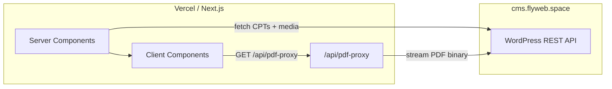

# Developer Guide — Grafitti Magazine

## Architecture Overview

The app uses two separate domains:

- **`cms.flyweb.space`** — WordPress CMS where editors manage content.
- **`grafitti-magazine.vercel.app`** (or custom domain) — Next.js frontend served from Vercel.



WordPress data is fetched **on the server** at request/build time. The browser never calls `cms.flyweb.space` directly for content. PDFs are an exception — they are streamed through `/api/pdf-proxy` to avoid browser CORS on static upload files.

---

## Key Files

| File | Role |
|------|------|
| `lib/wordpress.ts` | CMS URL, REST endpoints, ISR revalidation time |
| `lib/wordpress-service.ts` | TypeScript types + all fetch/transform functions |
| `lib/pdf-display-url.ts` | Converts CMS PDF URLs to same-origin proxy URLs |
| `app/api/pdf-proxy/route.ts` | Next.js Route Handler that proxies PDF files from CMS |
| `app/page.tsx` | Home page — async Server Component, fetches PDFs + videos |
| `components/home-page-content.tsx` | Client Component — renders PDFReader and Carousel |
| `components/pdfReader.tsx` | Interactive flipbook PDF viewer (client-only, no SSR) |
| `components/carousel.tsx` | Video carousel — accepts `videos` prop, no direct API calls |
| `app/article/[slug]/page.tsx` | Video article — async Server Component |
| `components/video-embed.tsx` | iframe wrapper for YouTube/Vimeo embeds |
| `.env.local` | Environment variables (not committed) |

---

## Data Flow

### Home Page

`app/page.tsx` is an **async Server Component**. It fetches data on the server and passes it as props to the client shell.

```typescript
// app/page.tsx
export default async function Home() {
  const [pdfs, videos] = await Promise.all([
    fetchPdfFiles(),
    fetchVideoPosts(),
  ]);
  return <HomePageContent pdfs={pdfs} videos={videos} />;
}
```

`components/home-page-content.tsx` is a `"use client"` component. It receives `pdfs` and `videos` as props and renders the flipbook and carousel. It does **not** call WordPress directly.

### Article Page

`app/article/[slug]/page.tsx` is also a Server Component. It resolves the video by slug on the server:

```typescript
// app/article/[slug]/page.tsx
const video = await getVideoBySlug(slug);
const allVideos = await fetchVideoPosts();
```

### PDF Proxy

When the PDF URL is on `cms.flyweb.space`, `lib/pdf-display-url.ts` rewrites it to `/api/pdf-proxy?url=...`. The browser requests the proxy which streams the file from WordPress server-side, bypassing browser CORS restrictions on static upload files.

---

## TypeScript Interfaces

### VideoPost

```typescript
interface VideoPost {
  id: number;
  slug: string;
  title: string;
  publishedDate: string;     // ISO date: "2026-02-28T10:00:00"
  description: string;       // Short text for carousel card
  fullDescription: string;   // Full article body (may contain HTML)
  thumbnail: string;         // Resolved image URL
  videoEmbedUrl: string;     // Normalized embed URL (YouTube/Vimeo)
}
```

### PdfFile

```typescript
interface PdfFile {
  id: number;
  slug: string;
  title: string;
  publishedDate: string;     // ISO date
  pdfFileUrl: string;        // Resolved PDF URL
}
```

---

## Fetch Functions

All functions are exported from `lib/wordpress-service.ts`. Use them only inside **Server Components** or Route Handlers.

```typescript
import {
  fetchVideoPosts,    // VideoPost[]  — all video posts
  fetchPdfFiles,      // PdfFile[]    — all PDF posts
  getVideoBySlug,     // VideoPost | undefined
  getPdfBySlug,       // PdfFile | undefined
} from '@/lib/wordpress-service';

const videos = await fetchVideoPosts();
const video  = await getVideoBySlug('my-video-slug');
```

Key behaviours:
- Errors return an empty array (never throw). Components stay functional if WordPress is unreachable.
- ISR revalidation is applied automatically (60 seconds by default, set in `.env.local`).
- Slugs with Georgian / non-ASCII characters are decoded correctly before matching.

---

## WordPress ACF Field Contract

These are the exact ACF field names the app reads. Editors must use these names and the recommended return formats.

### `video_post` CPT

| ACF Field Label | Field Name | Type | Return Format |
|---|---|---|---|
| Video Embed URL | `video_embed_url` | Text | — |
| Thumbnail | `thumbnail` | Image | Image Array |
| Short Description | `short_description` | Text Area | — |
| Full Description | `full_description` | WYSIWYG | — |

### `pdf_file` CPT

| ACF Field Label | Field Name | Type | Return Format |
|---|---|---|---|
| PDF File | `pdf_file` | File | **File URL** |

The ACF field group for each CPT must have **Show in REST API** enabled, otherwise `acf` will not appear in the REST response and all fields will be empty.

---

## Video Embed URL Rules

### YouTube

Any of these formats are accepted — the app normalizes them automatically:

```
https://www.youtube.com/watch?v=VIDEO_ID   ← paste from browser
https://youtu.be/VIDEO_ID                  ← share link
https://www.youtube.com/embed/VIDEO_ID     ← already embed format
```

### Vimeo

Vimeo does **not** auto-normalize like YouTube. You must use the player embed URL and configure Vimeo's domain allowlist.

**Required URL format:**
```
https://player.vimeo.com/video/VIDEO_ID
```

**Domain whitelist:** Go to Vimeo → video Settings → Privacy → "Where can this be embedded?" and add:
- `http://localhost:3000` (local dev)
- `https://grafitti-magazine.vercel.app` (production)

If the domain is not whitelisted, the iframe shows "vimeo.com refused to connect."

---

## Environment Variables

### `.env.local` (required)

```env
NEXT_PUBLIC_WORDPRESS_API_URL=https://cms.flyweb.space
NEXT_PUBLIC_ISR_REVALIDATE_TIME=60
```

### Optional — for media attachment ID resolution

Only needed if ACF returns attachment IDs instead of URLs (e.g. if Return Format is not set correctly):

```env
WORDPRESS_REST_USER=your_wp_username
WORDPRESS_REST_PASSWORD=your_wp_application_password
```

These are server-only (no `NEXT_PUBLIC_` prefix). Generate an Application Password in WordPress → Users → Profile.

### Vercel deployment

Add the same variables in Vercel project → Settings → Environment Variables.

---

## Common Tasks

### Add a new page that reads from WordPress

```typescript
// app/my-page/page.tsx
import { fetchVideoPosts } from '@/lib/wordpress-service';

export default async function MyPage() {
  const videos = await fetchVideoPosts();
  return (
    <div>
      {videos.map(video => (
        <div key={video.id}>{video.title}</div>
      ))}
    </div>
  );
}
```

### Format ISO date to "DD.MM.YY"

```typescript
function formatDate(isoDate: string): string {
  const date = new Date(isoDate);
  const day   = String(date.getDate()).padStart(2, '0');
  const month = String(date.getMonth() + 1).padStart(2, '0');
  const year  = String(date.getFullYear()).slice(-2);
  return `${day}.${month}.${year}`;
}
```

Already used in `components/carousel.tsx`.

### Render full description (HTML or plain text)

`fullDescription` may be plain text or WordPress block HTML. The article page handles this automatically with `ArticleDescription` in `app/article/[slug]/page.tsx`. Reuse the same pattern if you render `fullDescription` elsewhere.

---

## Debugging

### Server-side fetches are not visible in the browser Network tab

All WordPress REST calls happen on the Next.js server. To see them, check the **terminal** running `pnpm run dev` — fetch errors and warnings are logged there.

### Verify the REST API directly

Open these URLs in your browser (or Postman) to confirm what WordPress is returning:

```
# All video posts with ACF fields
https://cms.flyweb.space/wp-json/wp/v2/video_post

# Single video post by slug
https://cms.flyweb.space/wp-json/wp/v2/video_post?slug=your-slug

# All PDF posts
https://cms.flyweb.space/wp-json/wp/v2/pdf_file
```

Check that `acf` is present in the JSON. If it shows `"acf": false`, the ACF field group does not have "Show in REST API" enabled.

### Verify the PDF proxy

Open this in the browser to test the proxy directly:

```
http://localhost:3000/api/pdf-proxy?url=https://cms.flyweb.space/wp-content/uploads/2026/05/your-file.pdf
```

A 403 means the URL failed the allowlist check (must be under `/wp-content/uploads/` and end in `.pdf`).

### ISR cache

In development (`pnpm run dev`) content is always fresh. In production, pages are cached for 60 seconds. To see new WordPress content immediately after a change, wait 60 seconds or redeploy.

---

## Build & Deployment

### Development

```bash
pnpm run dev
```

### Production build

```bash
pnpm run build
pnpm start
```

The build pre-fetches WordPress data at compile time. ISR revalidates pages every 60 seconds in production without requiring a rebuild.

### Deployment notes

- Vercel Free plan is supported.
- Set all environment variables in Vercel project settings before deploying.
- CORS on WordPress is required for browser requests only. Since all WordPress REST fetches happen server-side, CORS mainly matters for potential future client-side calls. The PDF proxy bypasses CORS for the PDF binary itself.

---

## Common Issues

| Symptom | Likely cause | Fix |
|---------|-------------|-----|
| Carousel shows no videos | ACF field group "Show in REST API" is off | Enable it in ACF → Field Groups → Edit |
| Carousel shows videos but no thumbnails | ACF Thumbnail returning attachment ID without auth | Set Return Format to Image Array; or set `WORDPRESS_REST_USER/PASSWORD` |
| PDF shows "PDF Not Loaded" | `pdf_file` field empty or ACF not in REST | Upload a file to the ACF field; check "Show in REST API" |
| PDF proxy returns 403 | URL not under `/wp-content/uploads/` or does not end in `.pdf` | Check the actual URL in the REST JSON |
| Vimeo "refused to connect" | Vimeo domain whitelist or wrong URL format | Use `player.vimeo.com/video/ID` and add domain in Vimeo settings |
| YouTube video not playing | Using `/watch?v=` in ACF field | Any YouTube format works — app normalizes it automatically |
| Article page 404 | Slug mismatch (Georgian encoding) | Fixed in code; if still occurring check REST slug value matches what appears in the URL |
| Changes not showing | ISR cache | Wait 60s in production, or redeploy |
| CORS errors in browser console | Client-side code calling CMS directly | Move the fetch to a Server Component |

---

**For CMS setup instructions** (field groups, CPT configuration, CORS plugin) see `WORDPRESS_SETUP.md`.
